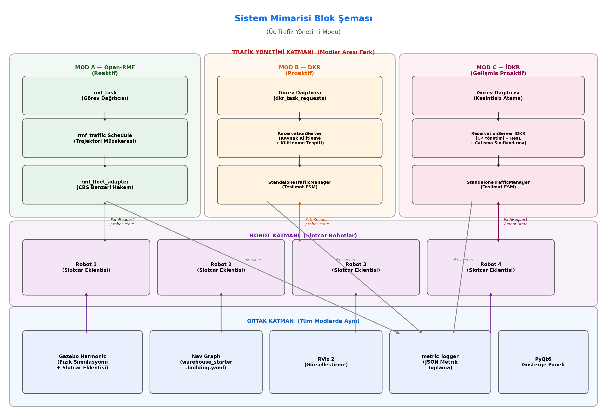
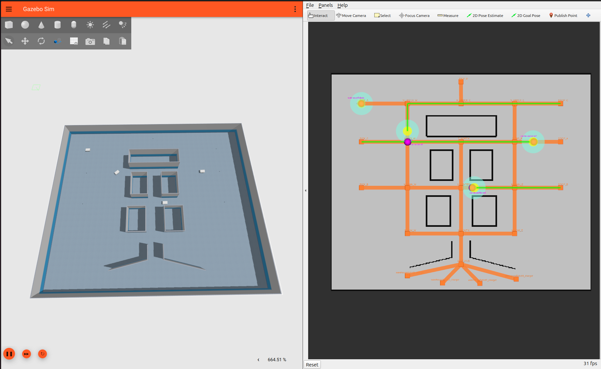
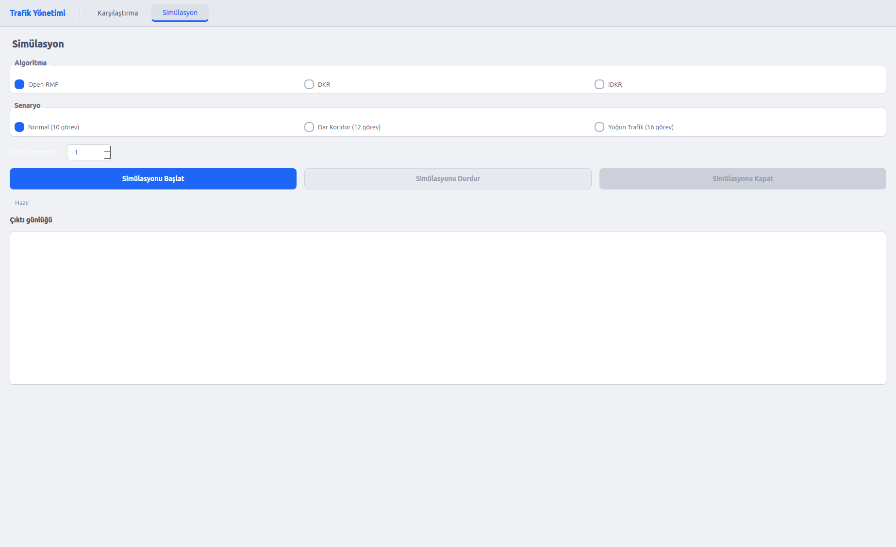
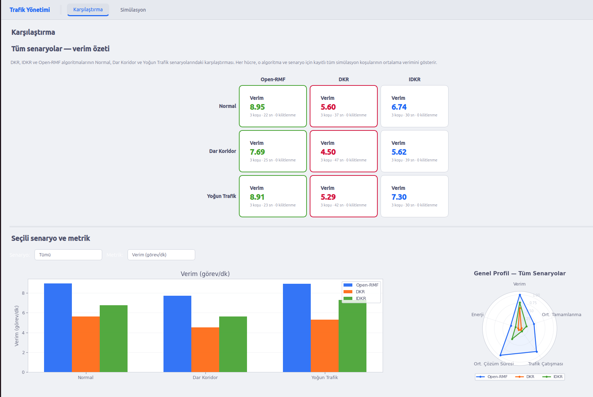
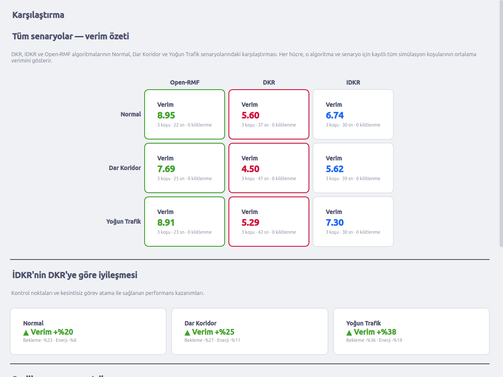
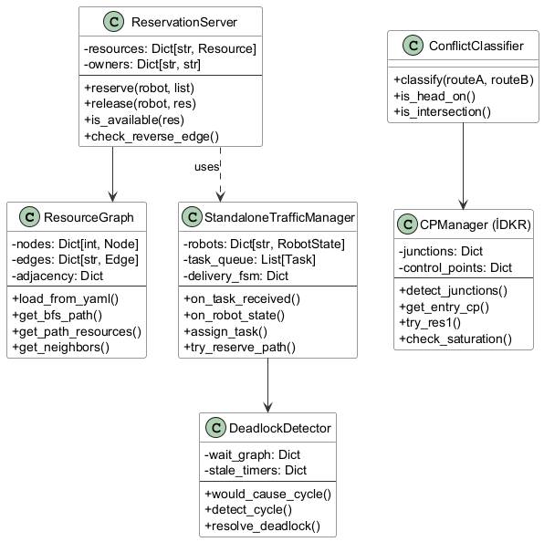

# Çok Robotlu Depo Ortamında Trafik Yönetimi

Depodaki robotların çarpışmadan hareket etmesi için Open-RMF, DKR ve İDKR algoritmalarını karşılaştıran ROS 2 projesi.

## Problem

Çok robotlu depo sistemlerinde robotlar aynı koridorları ve kavşakları paylaşır. Bu durum **trafik çatışmalarına**, **deadlock'lara** (robotların birbirini karşılıklı beklemesi) ve **verimsizliğe** yol açar. Open-RMF'in varsayılan müzakere tabanlı sistemi bu sorunları reaktif olarak çözerken, proaktif yaklaşımlar çatışmaları önceden engelleyebilir.

Bu projede Open-RMF'in mevcut trafik yönetimi ile iki yeni proaktif algoritma (DKR ve İDKR) geliştirilmiş ve farklı senaryolarda performansları karşılaştırılmıştır.

## Sistem Mimarisi

Sistem üç katmandan oluşur: trafik yönetim katmanı (algoritmalar), robot katmanı (Gazebo Slotcar eklentisi) ve ortak katman (simülasyon, görselleştirme, metrik toplama).



## Algoritmalar

### Open-RMF (Mod A — Reaktif)

Open-RMF'in varsayılan trafik yönetim sistemi. `rmf_traffic_schedule` ile trajektori müzakeresi ve `rmf_fleet_adapter` ile CBS benzeri çatışma çözümü uygular. Çatışmalar **olduktan sonra** müdahale eder.

### DKR — Dağıtık Kaynak Rezervasyonu (Mod B — Proaktif)

Nav graph üzerindeki her düğüm ve kenarı birer **mutex kaynak** olarak tanımlar. Robot hareket etmeden önce rotası üzerindeki tüm kaynakları **all-or-nothing** semantiğiyle kilitlemelidir. Deadlock tespiti için wait-for graph üzerinde döngü analizi yapılır. Çatışmaları **olmadan önce** engeller.

### İDKR — İyileştirilmiş DKR (Mod C — Gelişmiş Proaktif)

DKR'nin üzerine üç mekanizma ekler:

- **Kontrol Noktası (CP) Yönetimi**: Kavşakları (derece ≥ 3 düğümler) yönsel alt bölgelere ayırır. Farklı yönlerden gelen robotlar aynı kavşağı eş zamanlı kullanabilir.
- **Res1 Mekanizması**: Bir robot engellendiğinde, engelleyen robotu boş bir kontrol noktasına kaydırarak yol açar.
- **Çatışma Sınıflandırma**: Head-on, intersection ve pursuit olmak üzere üç çatışma tipini tespit eder ve her birine uygun çözüm stratejisi uygular.

Referans: Verma, Olm, Suárez — *"Improved Deadlock-Free Resource Reservation for Multi-Robot Systems"* (IEEE Access, 2024)

## Simülasyon Ortamı

Gazebo Harmonic üzerinde `warehouse_starter` haritasında **4 robot** ile çalışır. Robotlar farklı istasyonlar arasında teslimat ve devriye görevleri yürütür. RViz 2 ile nav graph, robot pozisyonları ve kaynak rezervasyonları gerçek zamanlı görselleştirilir.



## Dashboard (PyQt6)

Simülasyonları başlatma, metrik toplama ve algoritma karşılaştırma işlemlerini tek arayüzden yöneten gösterge paneli. Tüm deneyler terminal yerine bu arayüz üzerinden çalıştırılır.

**Simülasyon sekmesi** — algoritma (Open-RMF / DKR / İDKR), senaryo (Normal / Dar Koridor / Yoğun Trafik) ve tekrar sayısı seçilerek simülasyon tek tıkla başlatılır. Çıktı günlüğü gerçek zamanlı olarak ekrana yansır:



**Karşılaştırma sekmesi** — tamamlanan deneylerin verim, bekleme süresi, enerji tüketimi ve trafik çatışması metriklerini tablo ve grafiklerle karşılaştırır:



## Deneysel Sonuçlar

Üç senaryo üzerinde yapılan deneylerde İDKR, DKR'ye kıyasla tutarlı performans artışı göstermiştir:

| Senaryo | Görev Sayısı | İDKR Verim İyileşmesi | Bekleme Azalması | Enerji Azalması |
|---------|-------------|----------------------|------------------|-----------------|
| Normal | 10 | +%20 | -%23 | -%8 |
| Dar Koridor | 12 | +%25 | -%27 | -%11 |
| Yoğun Trafik | 16 | +%38 | -%36 | -%19 |



## Proje Yapısı

```
src/
├── dkr_controller/          # DKR algoritması
│   ├── reservation_server   # Merkezi kaynak kilitleme sunucusu
│   ├── resource_graph       # Nav graph → kaynak graf dönüşümü
│   ├── standalone_traffic_manager  # Görev dağıtım FSM
│   └── deadlock_detector    # Wait-for graph döngü tespiti
├── idkr_controller/         # İDKR algoritması
│   ├── reservation_server_idkr  # CP-destekli rezervasyon + Res1
│   ├── cp_manager           # Kavşak kontrol noktası yönetimi
│   ├── conflict_classifier  # Head-on / intersection / pursuit tespiti
│   └── deadlock_detector    # Döngü tespiti + SFP kontrolü
├── metric_logger/           # Deney metriklerini toplayan ROS 2 paketi
├── reservation_viz/         # RViz2 kaynak rezervasyon görselleştirme
└── rmf_demos/               # Open-RMF demo paketleri (warehouse_starter)
dashboard/                   # PyQt6 gösterge paneli
images/                      # Ekran görüntüleri
```

## UML Sınıf Diyagramı



## Gereksinimler

- Ubuntu 24.04
- ROS 2 Jazzy
- Gazebo Harmonic
- Open-RMF paketleri
- Python 3.12+, PyQt6

## Kurulum

```bash
# Workspace oluştur ve kaynak kodu klonla
mkdir -p ~/rmf_ws/src && cd ~/rmf_ws
git clone <repo-url> src/graduation_project

# ROS 2 bağımlılıklarını yükle
rosdep install --from-paths src --ignore-src -r -y

# Derle
colcon build --symlink-install

# Dashboard bağımlılıkları
pip install -r src/graduation_project/dashboard/requirements.txt
```

## Çalıştırma

```bash
source install/setup.bash
cd dashboard && python main.py
```

Dashboard üzerinden algoritma, senaryo ve tekrar sayısı seçilip **Simülasyonu Başlat** butonuna basılır. Gazebo, RViz ve trafik yönetim node'ları otomatik olarak açılır. Deney tamamlandığında sonuçlar kaydedilir ve Karşılaştırma sekmesinden incelenebilir.

